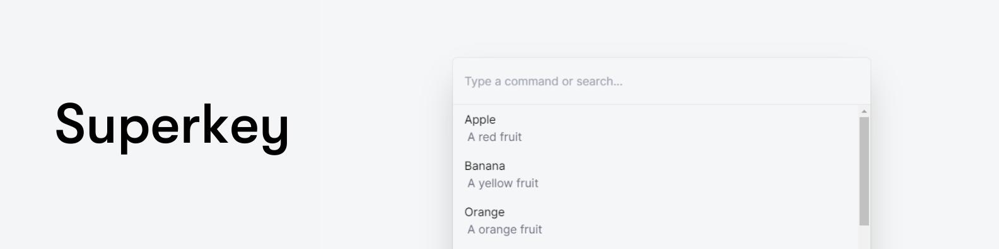

> 🚧 **Superkey is under development and is not ready for production**. If you have any bugs or problems please [create an issue](https://github.com/pheralb/superkey/issues/new). 🚧

<div align="center">

<a href="#">

</a>

<p></p>

<a href="#">Website (working 😊)</a>
<span>&nbsp;&nbsp;•&nbsp;&nbsp;</span>
<a href="#-getting-started">Getting Started</a>
<span>&nbsp;&nbsp;•&nbsp;&nbsp;</span>
<a href="#-examples">Examples</a>
<span>&nbsp;&nbsp;•&nbsp;&nbsp;</span>
<a href="#-contributing">Contribute</a>
<span>&nbsp;&nbsp;•&nbsp;&nbsp;</span>
<a href="#-roadmap">Roadmap</a>


</div>

## 👋 Introduction

**Superkey** is a stylized command palette component built with [React](https://reactjs.org/), [Tailwind CSS](https://tailwindcss.com/) & [HeadlessUI](https://headlessui.com/) ready to be used in your next project.

## 🚀 Getting Started

- 🚧 **Superkey is only compatible with React 18.**

### 1. Install dependency:

```bash
npm install superkey
```

### 2. Import styles:

```ts
import "superkey/styles.css";
```

### 3. How to use:

```tsx
import { Command, CommandInput, CommandList, CommandOption } from "superkey";

function App() {
  return (
    <Command open={true}>
      <CommandInput />
      <CommandList>
        <CommandOption value="Option 1">
          <h1>Option 1</h1>
          <p>Description</p>
        </CommandOption>
        <CommandOption value="Option 2">
          <h1>Option 1</h1>
          <p>Description</p>
        </CommandOption>
      </CommandList>
    </Command>
  );
}
```

- 🤔 Check examples [here](#-examples).

## 📚 Props

### Command

| -   | Prop               | Description                                              | Required     |
| --- | ------------------ | -------------------------------------------------------- | ------------ |
| ⚙️  | `children`         | Inside it uses the input, list and options components.   | **Required** |
| ⚙️  | `open`             | Open or close the command palette.                       | **Required** |
| ⚙️  | `commandFunction`  | Function to be executed when click an option.            | Optional     |
| ⚙️  | `onClose`          | Function to be executed when close the command palette.  | Optional     |
| ⚙️  | `afterLeave`       | Function to be executed after close the command palette. | Optional     |
| 🎨  | `className`        | Class to be added to the command palette.                | Optional     |
| 🎨  | `overlayClassName` | Class to be added to the overlay.                        | Optional     |

### CommandInput

| -   | Prop             | Description                                          | Type         |
| --- | ---------------- | ---------------------------------------------------- | ------------ |
| ⚙️  | `onChange`       | Action when the user types in the search field.      | **Required** |
| ⚙️  | `placeholder`    | The placeholder of the search text field.            | Optional     |
| 🎨  | `searchIcon`     | Adds an icon to the search field.                    | Optional     |
| 🎨  | `className`      | Class to be added to the all component.              | Optional     |
| 🎨  | `inputClassName` | Class to be added to the input text field component. | Optional     |

### CommandList

| -   | Prop       | Description                    | Type         |
| --- | ---------- | ------------------------------ | ------------ |
| ⚙️  | `children` | Inside imports CommandOptions. | **Required** |

### CommandOption

| -   | Prop        | Description                                       | Type         |
| --- | ----------- | ------------------------------------------------- | ------------ |
| ⚙️  | `value`     | Value of each option.                             | **Required** |
| ⚙️  | `children`  | Inside, the option information will be displayed. | **Required** |
| 🎨  | `className` | Modifies the styles of the option component.      | Optional     |

## 🗒️ Roadmap

- [ ] Improve light & dark mode.
- [ ] Add dark mode.
- [ ] Add more examples (using Remix).
- [ ] Create website.

## 📦 Examples

- [**Nextjs 13 + Typescript + Tailwind CSS**](https://github.com/pheralb/superkey/blob/main/web/src/example/command.tsx).
- [**Vitejs + React 18 + Typescript**](https://github.com/pheralb/superkey/tree/main/examples/with-vite-react-typescript).

## 🤝 Contributing

1. [Fork](https://github.com/pheralb/superkey/fork) & clone the project:

```bash
git clone git@github.com:[your-user]/superkey.git
```

2. Install dependencies:

```bash
cd superkey
npm install
```

3. Make your changes, create commits and push to your fork:

```bash
git add .
git commit -m "My super changes"
git push origin [your-branch]
```

4. Open a pull request 🚀.

## 🔑 License

- [MIT](https://github.com/pheralb/superkey/blob/main/LICENSE).
